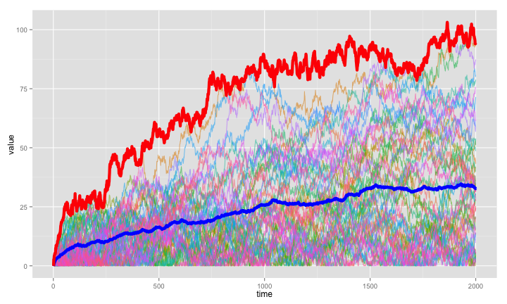

# Random walks and the complexity of life

*By Casey Dunn - http://dunnlab.org, http://creaturecast.org, [@caseywdunn](https://twitter.com/caseywdunn)*

There is great interest in the evolution of biological complexity. It is clear that life has become more complex in many respects through time. There used to only be unicellular life, and now there are many types of multicellular organisms. New cell types, tissues, and organs exist now that didn't exist billions of years ago. Evolution has resulted in many life forms that have complex traits not found in their ancestors. 

But the simple observation that evolution can produce complexity does not necessarily mean that evolution favors increased complexity. Evolution results in change, and that change can be an increase or a decrease. There are many lineages that have secondarily lost complex structures. Snakes, for example, no longer have limbs.

In fact, we should expect an increase in the overall complexity of life when the chance of evolution resulting in an increase in complexity within a lineage is *exactly the same* as the chance of a decrease in complexity.

This can be illustrated with a very simple simulation based only on the following three 
conditions:

- The complexity of a trait can be measured on a scale from 0 to infinity, where 0 is the simplest possible condition.

- In each generation, complexity can increase or decrease by a random amount. The amount of change is sampled from a standard normal distribution, so that there is just as much chance of increasing as there is of decreasing.

- The complexity of the trait starts at 0, i.e. the simplest condition.

Below I've implemented such a simulation (the source code for this document, which includes the simulation code, is at https://github.com/caseywdunn/random_walk), with 50 lineages and 2000 generations. Each of the thin lines is a simulated lineage. The position along the X axis indicates time, and the position along the Y axis indicates the complexity of the trait under study (you could think of it as the number of cell types, for example). The blue line is the mean complexity across lineages. The red line is the maximum complexity across all lineages. 

 

Both the mean complexity and maximum complexity tend to increase through time, even though the chance of increasing or decreasing within any one of the lineages is exactly the same.

What is happening here? Basically, complexity starts at 0, and has nowhere to go but up. So it goes up through time. The trend across lineages through time is a result of a boundary condition (complexity cannot go below zero), not a greater chance of increase than decrease.

What does this tell us? Many things. But one of them is that we shouldn't be surprised by evolutionary decreases in complexity within lineages even when we see overall increases in complexity across lineages. We expect to see overall increases in complexity across lineages even when the chances of increasing or decreasing complexity within lineages are exactly the same. There isn't evolution (when a trait increases) and de-evolution (when a trait decreases) - just evolution. Evolution is change, regardless of the direction of change.

